# Procesverslag
Markdown is een simpele manier om HTML te schrijven.  
Markdown cheat cheet: [Hulp bij het schrijven van Markdown](https://github.com/adam-p/markdown-here/wiki/Markdown-Cheatsheet).

Nb. De standaardstructuur en de spartaanse opmaak van de README.md zijn helemaal prima. Het gaat om de inhoud van je procesverslag. Besteedt de tijd voor pracht en praal aan je website.

Nb. Door *open* toe te voegen aan een *details* element kun je deze standaard open zetten. Fijn om dat steeds voor de relevante stuk(ken) te doen.

## Jij

  
uitwerken voor kick-off werkgroep

  ### Auteur:
  Louiza El Bahi

  #### Je startniveau:
  Mijn startniveau is blauw/rood.

  #### Je focus:
  Surface plane
 

## Je website

  
uitwerken voor kick-off werkgroep

  ### Je opdracht:
  https://mrmen.com/

  #### Screenshot(s) van de eerste pagina (small screen): 
  Home 
  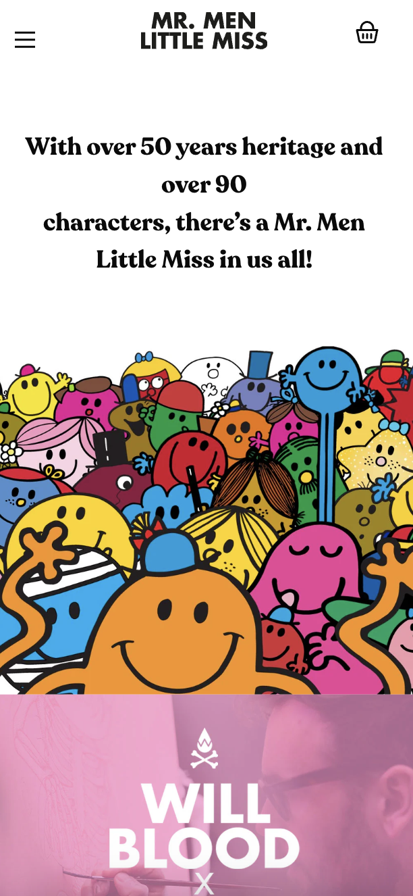
  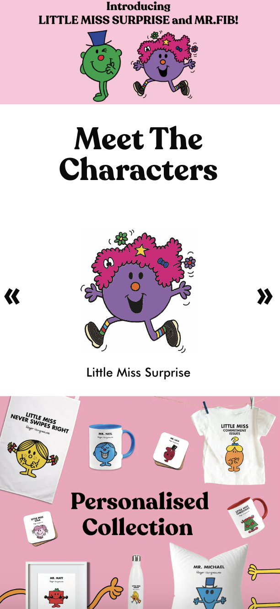
   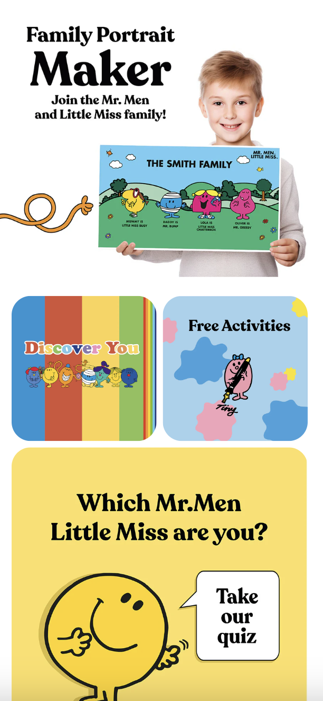
    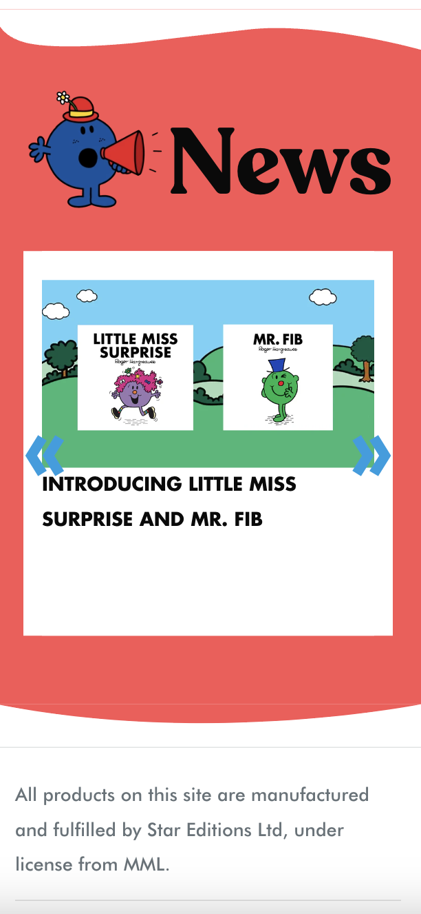
     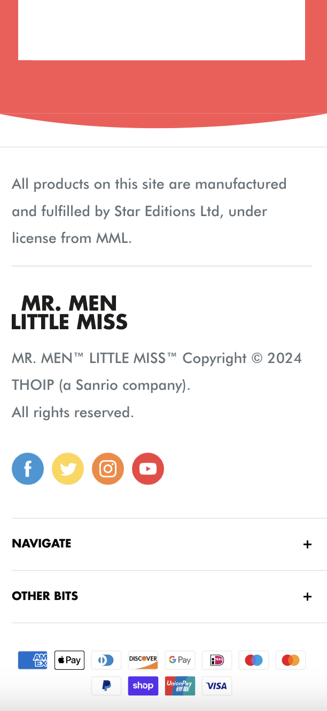

  #### Screenshot(s) van de tweede pagina (small screen):
  mr strong t-shirt pagina
  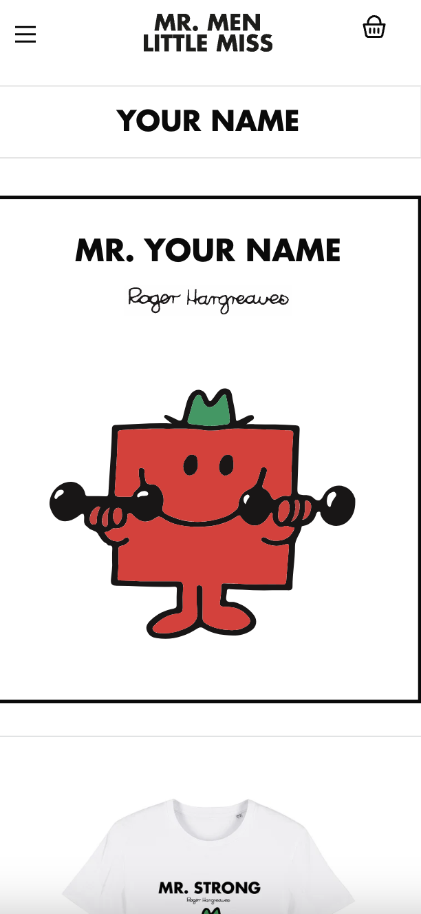
   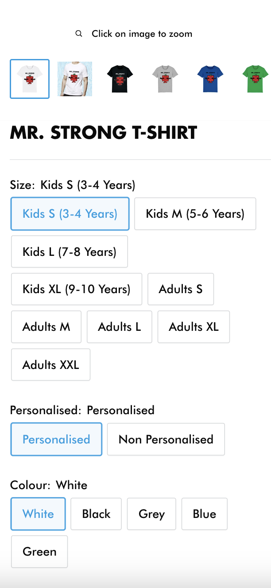
    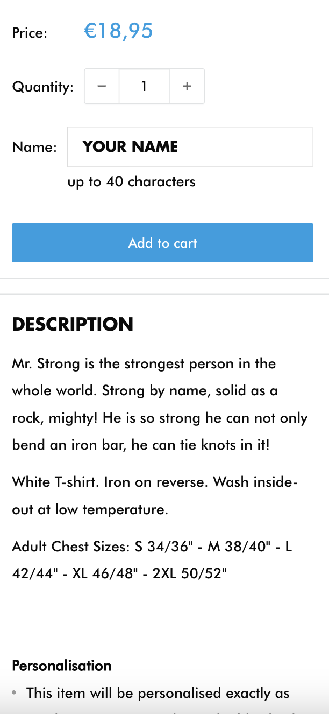
     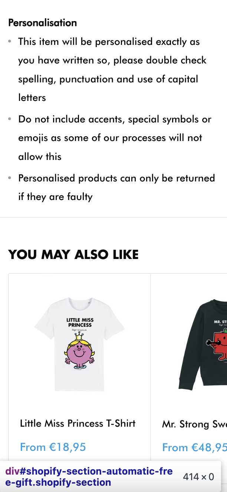
  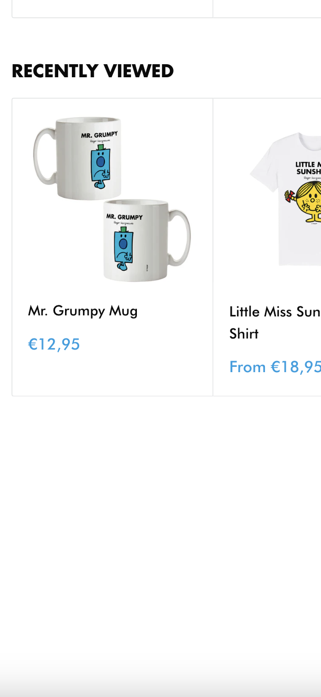
   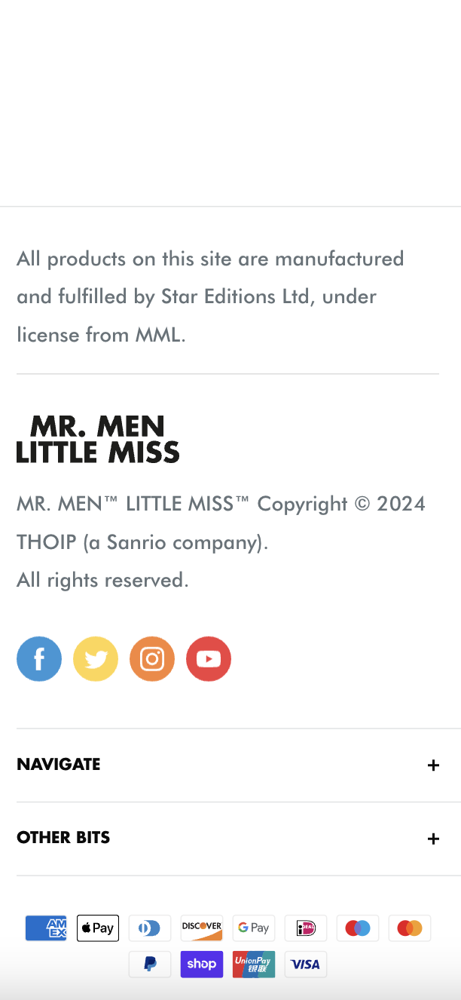

## Toegankelijkheidstest 1/2 (week 1)

  
uitwerken na test in 2e werkgroep

  ### Bevindingen
  Lijst met je bevindingen die in de test naar voren kwamen:
  Bevindingen die in de test naar voren kwamen was dat het voornamelijk op de eerste pagina allemaal naar voren kwam. 
  
 Content: De content was goed gestructureerd.
 
 Globale code: De gebruikte code bevatte taalattributen en zorgde ervoor dat inzoomen op de viewport niet was uitgeschakeld. Echter, elke pagina had geen unieke titel, en bij validatie van de HTML kwamen er enkele fouten naar voren.

 Toetsenbord: Voor beide vakjes was het antwoord "ja". De website kan volledig bediend en genavigeerd worden met alleen een toetsenbord.
 
 Mobiel en touch: De website kan worden gedraaid naar elke oriëntatie, maar horizontaal scrollen kan niet worden uitgeschakeld. Knoppen en links zijn makkelijk aan te klikken en vaak groot en goed herkenbaar. Toch is het soms onduidelijk of een afbeelding een knop is of gewoon een foto. Er is voldoende ruimte tussen sommige interactieve elementen, maar dit kan nog verder verbeterd worden, omdat sommige foto's te dicht op elkaar staan.

 Headings: Dit onderdeel schoot tekort. Er werden geen heading-elementen gebruikt om content in te leiden, en vaak ontbrak een H1-kop. Hierdoor werden sommige kopniveaus overgeslagen, wat de structuur van de pagina's minder duidelijk maakt.

 Lijsten: Volgens de beoordeling werden er geen lijst-elementen gebruikt op de website. Echter, dit klopt niet volledig. Lijst-elementen zijn wel zichtbaar, zoals in het menu en bij de sectie 'meet the characters' in de carrousel.

 Afbeeldingen: Niet alle img-elementen op de website hebben een alt-attribuut, wat belangrijk is voor toegankelijkheid. Daarnaast bevat de alt-beschrijving soms dezelfde tekst als de afbeelding, wat niet altijd zinvol is. Het is beter om een beschrijving te geven die de functie of betekenis van de afbeelding weergeeft, zodat deze nuttig is voor zowel gebruikers als zoekmachines.

 Media (Video and Audio):  Momenteel zijn er geen media-elementen, zoals audio of video, op de website aanwezig. Ik heb echter plannen om in de toekomst een audio/liedje toe te voegen voor het 'surface plan'. Het is belangrijk dat deze video niet automatisch wordt afgespeeld, zodat gebruikers zelf kunnen kiezen wanneer ze de video willen bekijken. 

 Controls: Voor links wordt het a-element correct gebruikt, en links zijn duidelijk herkenbaar als links. Echter, de besturingselementen, zoals knoppen en links, hebben geen duidelijke focusstaat. Dit maakt het lastiger voor toetsenbordgebruikers om te zien welke elementen actief zijn tijdens navigatie. 

 Appearance: In het formulier stond dat de website verschillende kleurenmodi ondersteunt, maar de website blijft altijd hetzelfde, of het nu donker of licht is.

 Animaties: De animaties op de website zijn subtiel. Wanneer je een van de karakters aanraakt, bewegen ze. Deze animaties houden rekening met de 'prefers reduced motion'-mediaquery, wat betekent dat gebruikers die animaties willen beperken, hier geen hinder van ondervinden. Dit zorgt voor een toegankelijkere ervaring voor mensen die gevoelig zijn voor bewegende content.

 Color contrast: Alles in het kleurcontrastformulier was goedgekeurd met "ja", behalve de optie voor aangepaste selectie kleuren. Dit betekent dat de kleuren voor geselecteerde tekst niet zijn aangepast, wat de leesbaarheid kan beïnvloeden.

## Breakdownschets (week 1)

  
uitwerken na afloop 3e werkgroep

  ### de hele pagina: 
  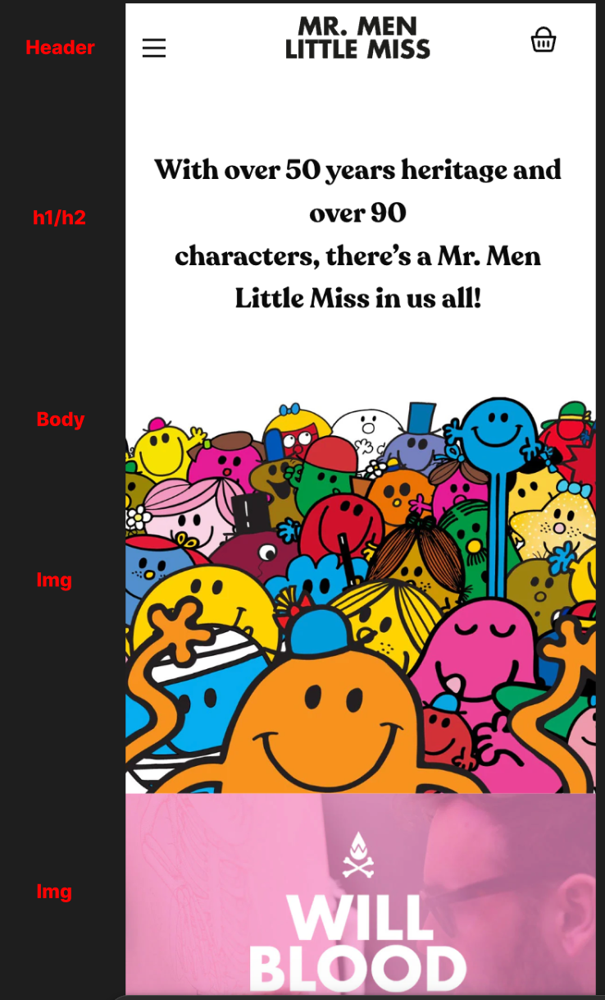
    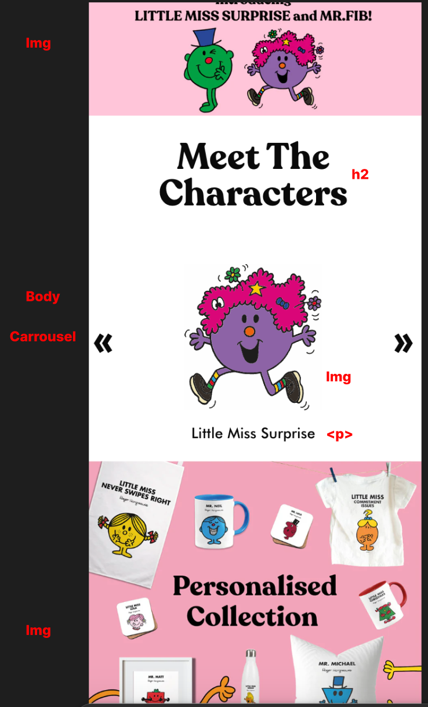
      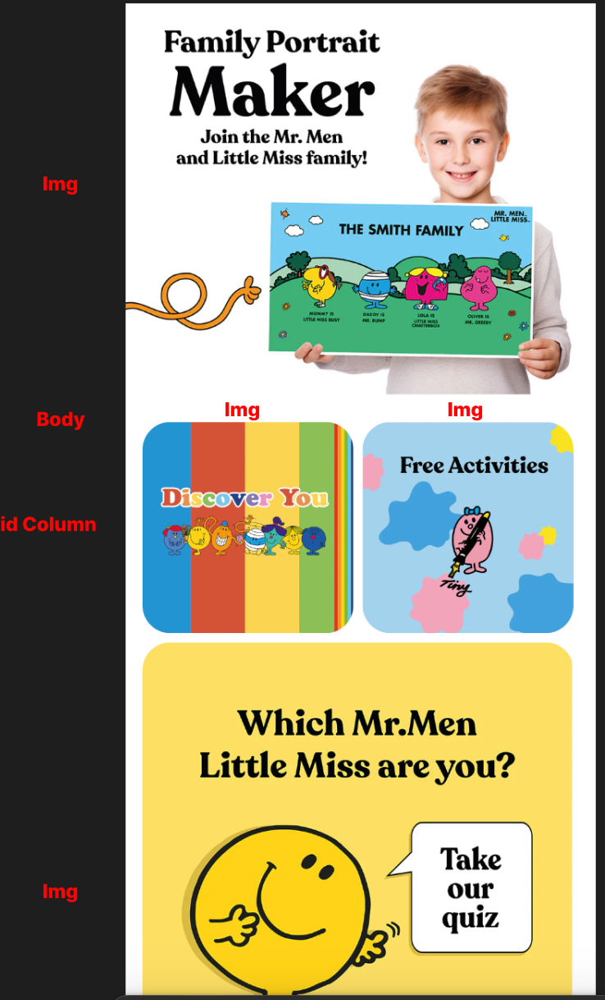
        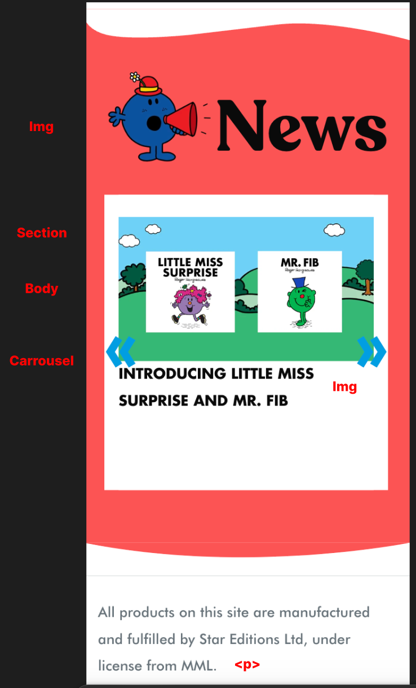
          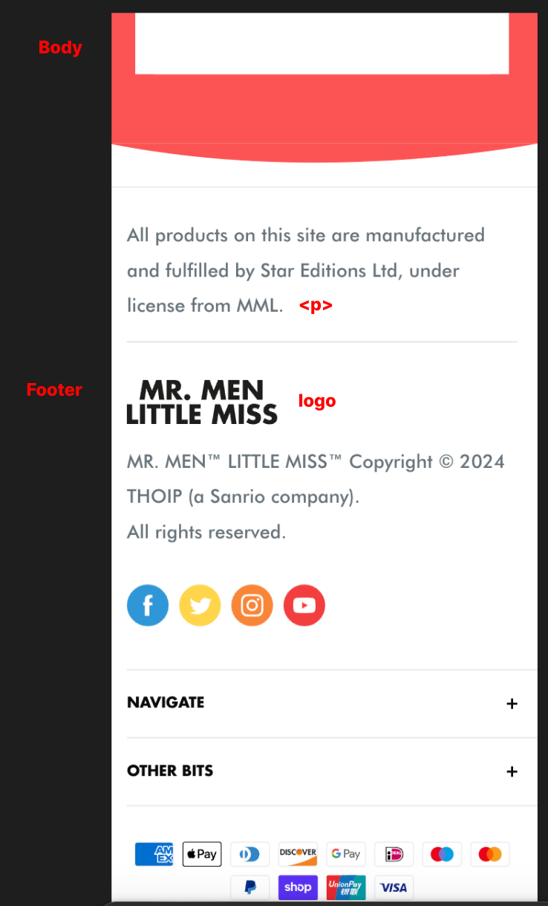

  ### dynamisch deel (bijv menu): 
  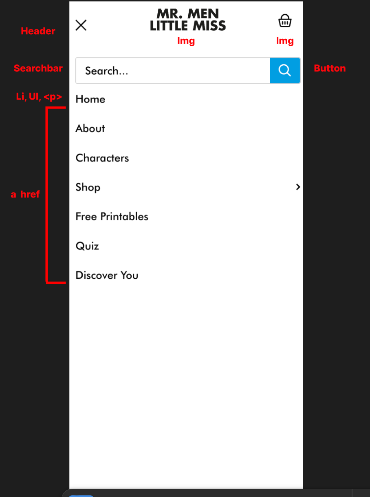

## Voortgang 1 (week 2)

  
uitwerken voor 1e voortgang

  ### Stand van zaken
  hier dit ging goed & dit was lastig (neem ook screenshots op van delen van je website en code)

 Ik heb op dit moment alleen nog de eerste pagina afgerond, waar ik me vooral richtte op de HTML en CSS. Ik heb me geconcentreerd op de vormgeving om te begrijpen hoe alles in elkaar zat en hoe de knoppen werkten. Echter, ik heb moeite met het niet gebruiken van divs en IDs, omdat het alleen werken met secties soms onhandig is. Op de originele site worden veel divs gebruikt, en ik moest af en toe spieken om te zien hoe bepaalde elementen eruitzagen en functioneerden. Daarnaast vond ik het vormgeven van de carrousel best moeilijk. De foto’s blijven zichtbaar terwijl ik wilde dat ze pas verschenen als je op de knop voor de volgende foto drukte. Dit ga ik zeker vragen aan de student-assistent of docent voor hulp.Wat betreft het menu heb ik de vormgeving wel af, maar het werkt nog niet zoals het zou moeten. Het ziet er nog niet echt goed uit omdat alle lijstitems zichtbaar zijn in plaats van mooi ingedeeld. Ook waren de plaatjes van de karakters te breed, dus ik moet ze nog verkleinen. Ook hier ga ik om hulp vragen, want zonder het gebruik van divs wordt het behoorlijk lastig.

 Ik zit wel op schema, en wat ik fijn vond, is dat ik de plaatjes gemakkelijk kon vinden op de website zonder dat ik ze hoefde te screenshotten. Daar was ik eerst een beetje bang voor, omdat het er dan vaak zo wazig uitziet. Het positioneren van de elementen ging ook goed, vooral met de opdrachten die we hebben gekregen. Daarnaast leek het lettertype dat ik heb gekozen erg op het lettertype van de originele website, wat mooi aansluit bij de huisstijl. Ik ben veel vergeten van vorig jaar, dus deze week was vooral een moment om even terug te kijken en te herontdekken hoe alles werkt.

  ### Vragen die ik ga stellen bij de feedbackgesprek

- Hoe kan ik het menu eenvoudig maken met JavaScript?
- Hoe werkt de carrousel precies?

## Voortgang 2 (week 3)

  
uitwerken voor 2e voortgang

  ### Stand van zaken

 Wat goed ging, was het gebruik van de grid column. Dit werkte goed en hielp me om de layout van de website overzichtelijk en gestructureerd te maken. 
 
 Ik begon helemaal opnieuw met de tweede pagina, omdat ik dacht dat het gemakkelijker zou zijn om een andere pagina te maken met de surface plane. De oorspronkelijke tweede pagina leek namelijk te veel op de homepage. Uiteindelijk heb ik ervoor gekozen om een shirtpagina te maken, waar bezoekers een shirt kunnen kopen.

 Wat ik moeilijk vond, was het maken van het menu. Dit was de eerste keer dat ik zo'n menu maakte. Dankzij de opdrachten die ik volgde, ging het echter redelijk goed. Daarnaast vond ik het ook lastig om een foto te vergroten zonder een div te gebruiken. Ik heb dit opgelost door de afbeelding te schalen.

  ### Vragen die ik ga stellen bij de feedbackgesprek

  - Hoe kan ik het aantal divs en ID's verminderen?
  - Hoe kan ik het menu laten verschijnen zonder dat het van links komt?
  - Ziet de tweede pagina er hetzelfde uit als de eerste pagina?

## Toegankelijkheidstest 2/2 (week 4)

  
uitwerken na test in 9e werkgroep

  ### Bevindingen
  Lijst met je bevindingen die in de test naar voren kwamen (geef ook aan wat er verbeterd is):

  De verbeteringen in de test omvatten het gebruik van de koppen h1, h2, en h3, wat in de originele site minder aanwezig was. Ik heb ervoor gezorgd dat er een duidelijke hiërarchie in de inhoud naar voren komt. Daarnaast is er nu een light-dark mode toegevoegd, iets dat de oorspronkelijke site niet had, evenals de mogelijkheid om de lettergrootte aan te passen, wat de toegankelijkheid vergroot. Ook hebben alle afbeeldingen nu een alt-tekst, wat ontbrak in de originele versie van de site.

  De HTML en CSS bevatten geen foutmeldingen, wat wel het geval was in de HTML van de originele 'Mr. Men Little Miss'-site. Er is nu ook een audio-element toegevoegd dat met een pauzeknop kan worden gestopt. Daarnaast heb ik meerdere keren gebruikgemaakt van lijst-elementen.

## Voortgang 3 (week 4)

  
uitwerken voor 3e voortgang

  ### Stand van zaken
  hier dit ging goed & dit was lastig (neem ook screenshots op van delen van je website en code)

 Wat goed ging bij het maken van de website waren vooral de aspecten die te maken hadden met de vormgeving. Ik was blij dat veel elementen overeenkwamen met de originele pagina, waardoor het ontwerp herkenbaar en aantrekkelijk bleef. Daarnaast werkte ik met extra functies, zoals de surface plane, en ik was tevreden dat dingen zoals het geluid van het audioliedje en de opties voor donkere en lichte modus goed functioneerden. Deze elementen droegen bij aan een betere gebruikerservaring en maakten de website levendiger."

 Een van de grootste uitdagingen was het verminderen van het aantal divs in mijn project. Dit zorgde ervoor dat de code minder overzichtelijk werd en het ontwerp niet altijd zo strak was als ik had gewild. Hierdoor ben ik niet volledig tevreden met het eindresultaat. Er zijn verschillende aspecten die ik beter had willen aanpakken, zoals de knoppen op de shirtpagina. Ik vond het maken van de carrousel ook moeilijk. Daarom heb ik veel hulp gevraagd aan medestudenten, websites bezocht en zelfs ChatGPT gebruikt. Ondanks deze hulp bleef het lastig voor me. Een probleem was het gebruik van divs; ik moest het overzichtelijker maken, vooral omdat ik twee carrousels op één pagina had. Dit leidde soms tot overlap, waardoor dingen niet goed werkten of de CSS er niet hetzelfde uitzag.

  ### Vragen die ik ga stellen bij de feedbackgesprek

  - Hoe ik de carrousel kan verbeteren.
  - Hoe kan ik de social media iconen laten bewegen (ronddraaien).
  - Hoe kan ik de navigatie laten uitklappen en inklappen wanneer ik op het plusje druk?
  - Hoe kan ik het T-shirt laten in- en uitzoomen als je erop klikt?

## Eindgesprek (week 5)

  
uitwerken voor eindgesprek

  ### Je uitkomst - karakteristiek screenshots:
  

  ### Dit ging goed/Heb ik geleerd: 

  De vormgeving vond ik over het algemeen best makkelijk. Ik vind dat het er echt goed uitzag en dat ik goed werk heb geleverd. De menubalk heb ik ook goed gedaan, ook al wilde ik dat het net als op de originele site niet van links kwam. Uiteindelijk heb ik dat niet meer veranderd, maar ik heb geleerd om me aan te passen en het beste uit mijn ontwerp te halen.

  Wat ik erg leuk vond, was dat ik nu heb geleerd om met grid-columns te werken. Dit had ik in voorgaande opdrachten nog niet gedaan, en het was voor mij een nieuwe ervaring. Ik vond het een makkelijke manier om de lay-out van de website te maken. Dankzij de opdrachten heb ik hier veel tijd aan besteed en daardoor ging het proces ook soepel en snel.

  Ik ben ook trots op de naamsverandering op de tweede pagina, waar je de naam van de tekst kunt aanpassen. In het begin had ik hier best moeite mee. Na veel proberen lukte het me eindelijk om het goed te krijgen. Het was een uitdaging, maar dat maakt het extra leuk als je het uiteindelijk kunt doen.

  In het algemeen vond ik deze opdracht best moeilijk, vooral omdat ik niet de beste ben in coderen. Coderen kan soms een beetje verwarrend zijn, en ik moest vaak opnieuw beginnen als iets niet werkte. Maar ondanks dat ben ik trots op het eindontwerp dat ik heb gemaakt. Hoewel het op sommige punten niet helemaal lijkt op de originele site, heb ik ervoor gezorgd dat veel dingen goed werken.  

  Tijdens dit project heb ik veel geleerd. Ik heb geleerd hoe ik een menubalk kan maken en hoe ik een echte website kan bouwen. Daarnaast heb ik ook interacties toegevoegd, wat de website levendiger maakt. Het was ook een leuke uitdaging om muziek aan de website toe te voegen en om te leren hoe je de tekst groter of kleiner kunt maken.

  Wel vond ik dat de knoppen die ik heb gemaakt er niet echt uitzagen zoals die op de originele website. Dit was iets wat ik nog wilde aanpassen, maar ik had daar niet meer de tijd voor. Ondanks dat ben ik blij met wat ik heb bereikt en dat ik deze nieuwe vaardigheden heb geleerd.  

  

  ### Dit was lastig/Is niet gelukt:
  
  Wat minder goed ging, waren de micro-interacties zoals de carrousel en de navigatie. Alles wat met JavaScript te maken heeft, vind ik nog best lastig. Ik heb hiervoor veel hulp gezocht bij ChatGPT, medestudenten en de docent, maar ik heb hier echt mee geworsteld. Ook was mijn code soms best rommelig, waardoor het soms niet goed werkte.

  Wat niet gelukt is, is om de navigatie klapbaar en opklapbaar te maken, maar ik besef dat niet alles perfect hoeft te zijn. Qua vormgeving heb ik ook veel moeite gehad. Vooral toen ik JavaScript moest toevoegen, liep het lastig. Dit is goed te zien bij het nieuwsblok; het ziet er niet zo exact uit als de originele pagina, hoe vaak ik het ook probeerde. Het leek wel alsof, wanneer ik iets veranderde, de code niet meer werkte of de vormgeving weer anders uitzag. Van de eerste pagina was dit het moeilijkste deel voor mij.

  Het gebruik van veel divs en IDs vind ik ook jammer. Eigenlijk mag dat voor deze opdracht niet, maar alleen werken met secties en artikelen lukte niet voor mij. Het was echt een proces van vallen en opstaan.

  Op de tweede pagina heb ik ook vooral geworsteld met de vormgeving. Nadat de eerste pagina al klaar was, moest ik hier ook secties gebruiken, waardoor het er niet hetzelfde uitzag. Eerst dacht ik eraan om twee stijlen te gebruiken, maar de docent raadde dat af en adviseerde om gewoon één stijl te gebruiken om verwarring te voorkomen. Ik vind het jammer dat ik sommige dingen, zoals het inzoomen op het T-shirt, niet heb kunnen toevoegen. 

  Op een gegeven moment heb ik iets veranderd waardoor de pagina nu een beetje naar rechts scrolt. Ik heb van alles geprobeerd om het probleem op te lossen en het terug te zetten naar hoe het was, maar dat is nog niet gelukt. Het lijkt door een fout in de CSS te komen, maar ik weet nog niet precies waar die fout zit. Als ik meer tijd had gehad, had ik de dark mode en light mode niet alleen voor de tekst, maar ook voor andere onderdelen zoals het menu en het logo kunnen aanpassen. Doordat het logo een afbeelding is, blijft het zwart, wat ervoor zorgt dat het menu niet goed zichtbaar is.

  

## Bronnenlijst

  
continu bijhouden terwijl je werkt

  Nb. Wees specifiek ('css-tricks' als bron is bijv. niet specifiek genoeg). 
  Nb. ChatGpT en andere AI horen er ook bij.
  Nb. Vermeld de bronnen ook in je code.

  1. how to do dark mode: https://volodymyrzh.medium.com/implementing-dark-mode-with-css-and-javascript-fd3b2105e081
  2. Asked help from chatgpt with how to increase a font size with a button.
  3. Asked chat GPT prompt: how to make a button (+) that opens the navigation and closes. Like the hamburger menu. 
  4. Asked GPT how to do this. Prompt: How to make a navigation that opens and closes but doesn't hinder the rest of the content.5.  With help from chat gpt. Prompt: how to make a carrousel that at the end in jumps back to the beginning.
  6.  Asked Chat gpt how to do this with the prompt: How do I make it so that when you fill in your name in the text box, it automatically updates elsewhere in the text?

